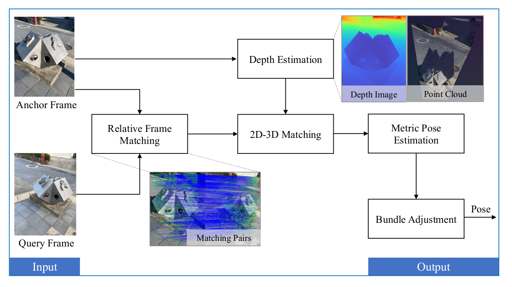

#### Technical Report: Metric Pose Estimation Relative to Anchor Frame for Map-free Localization

This is a solution for Map-free Visual Localization Challenge 2024. Named interp_metric3d_loftr_3d2d at [leaderboard](https://research.nianticlabs.com/mapfree-reloc-benchmark/leaderboard?t=single&f=2024) 

